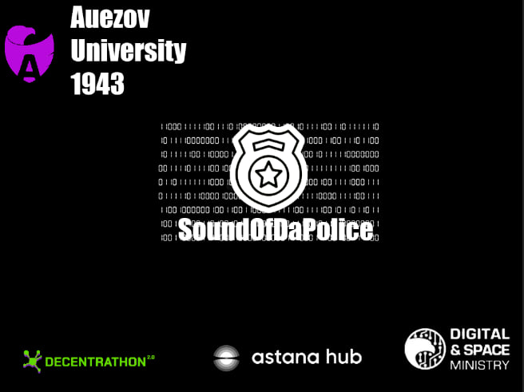

# CitySimulator



## Описание

Это мобильная игра, симулятор городского трафика с акцентом на пешеходов. В игре NPC-пешеходы перемещаются по пешеходным зонам, таким как тротуары, грунтовые дорожки и зелёные зоны, избегая дорог для автомобилей. Игрок может взаимодействовать с NPC, используя диалоговые окна, а также управлять своим персонажем через стрелки управления. Основная цель игры — создать атмосферу оживлённого городского пространства, где каждый NPC ведёт себя по-своему, но соблюдает правила движения по пешеходным зонам.

## Особенности

- **Пешеходные зоны**: NPC перемещаются только по пешеходным зонам, обходят препятствия и избегают дорог для машин.
- **Случайные цели**: Каждый NPC генерирует случайную точку назначения, анимации движения плавно адаптируются под поведение.
- **Интерактивные диалоги**: Игрок может начать разговор с любым NPC, открывая диалоговые окна.
- **Управление**: Простая система управления для игрока с использованием стрелок для перемещения по городу.
- **Unity NavMesh**: Использование Unity NavMesh для управления движением и обхода препятствий.

## Установка

1. **Скачайте репозиторий**: Клонируйте или загрузите ZIP-архив с репозиторием и распакуйте его.
   
   ```bash
   git clone https://github.com/yourusername/CitySimulator.git
Переместите файлы: Скопируйте файлы игры в свою рабочую директорию Unity.

Установите NavMesh Components: Убедитесь, что у вас установлен пакет NavMesh Components для корректной работы NPC. Это можно сделать через Package Manager в Unity.

Запустите сцену: Откройте сцену в Unity и нажмите Bake в окне Navigation для генерации NavMesh по пешеходным зонам.

Как играть
Управление персонажем: Используйте стрелки на экране для перемещения по городу.
Взаимодействие с NPC: Подходите к NPC и нажимайте на появляющиеся кнопки для общения.
Наблюдайте за NPC: Следите за перемещениями NPC, которые свободно ходят по городу, избегая дорог и препятствий.
NPC поведение
NavMeshAgent: Используется для передвижения NPC по пешеходным зонам. NPC обходят препятствия (например, деревья и скамейки) и не ходят по дорогам для машин благодаря системе NavMeshObstacle.
Интеллект NPC: Определяет вероятность столкновения с препятствиями и адаптируется под окружение. В зависимости от настроек NPC могут избегать объектов с определёнными материалами (например, дороги).
Система обхода препятствий: Если NPC обнаруживает дорогу или препятствие, он выбирает альтернативное направление для продолжения пути.
Технические требования
Unity: Версия 2020 и выше
NavMesh Components: Устанавливаются через Package Manager
Поддержка устройств: Мобильные устройства с поддержкой Android и iOS
Контакты
Если у вас есть вопросы или предложения, свяжитесь с нами на email@example.com.
